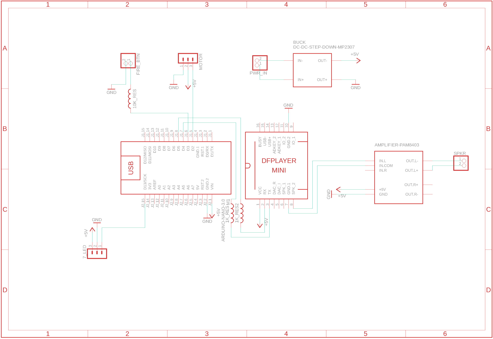

## se14r-blaster V0.4 - Prerelease
Code for the Star Wars SE-14r blaster from Props 3D

Note that prerelease models have been tested and work, but do not come with instructions or guarantee that everything fits together properly. If you want have feedback please post on our discord(https://discord.gg/NSfZcCfJU6) on the #project-starwars-se14r channel

## Props 3D
* Join the Props3D Discord: https://discord.gg/NSfZcCfJU6
* Follow progress on instagram: https://www.instagram.com/props3dpro/
* Subscribe on Youtube: https://www.youtube.com/c/Props3D
* Download released designs: https://www.thingiverse.com/props3dpro/designs

## Electonic Components
* Arduino Nano v3
* DF Player Mini + 64mb Micro SD Card
* Speaker Amp - PAM8302A
* 7 bit LED - Neopixel (circular, NOT the ring)
* 40mm 2W speaker
* 7mm momentary switch
* Mini 360 DC-DC Buck Converter
* Lipo 7.4v
* 2 X 1K Resister
* OPTIONAL
* * DRV2605L breakout board
* * 1 or 2 ERM haptic motor 8mm

First Header | Second Header
------------ | -------------
 | 
Content in the first column | Content in the second column

First Header | a
------------ | -------------
 | 
Content in the first column | Content in the second column

## Parts

* 4x20 pellet gun scope (ebay or aliexpress)
* M5X8mm~12mm Flat X 4 - Grips
* M4X12mm Socket X 2 - Reciever Joiner
* M4X8mm Button X 3 - Scope
* M3X6mm Button X 2 - Haptic Driver
* M3X4~8mm Button X 4 - Battery Cover
* M3X6mm Socket X 3 - Trigger switch / LED
* M3X4~8mm Grub X 5 - BarrelCap / Sight
* M4X6~8mm Grub X 6 - Magazine/Stock Bracket

## Required Libraries
There's are number of libraries that you will need to install using the Arduino Library Manager:
 1. DFPlayerMini_Fast
 2. FastLED
 4. FireTimer
 5. ezButton
 6. Adafruit_DRV2605

## Setup and Configuration
The code can be used by updating the values in config.h based on your components,
wiring, and audio tracks.

```c++   
#define ENABLE_DEBUG               1

// Comment out if you want to disable audio
#define ENABLE_EASY_AUDIO          1 //Enable all audio 
#define ENABLE_EASY_BUTTON         1 //Enable all buttons
#define ENABLE_EASY_HAPTIC         1 //Enable haptic motors

// Pin configuration for MP3 Player
#define AUDIO_RX_PIN        10
#define AUDIO_TX_PIN        11

// Pin configuration for all momentary triggers
#define TRIGGER_PIN         8

// Pin configuration for front barrel WS2812B 7bit LED
#define FIRE_LED_PIN        13
#define FIRE_LED_CNT        7

// track by file index - upload these to the SD card in the correct order
#define TRACK_START_UP        1
#define TRACK_CHANGE_MODE     2
#define TRACK_FIRE_A          3
#define TRACK_FIRE_B          4
#define TRACK_STUN_A          5
#define TRACK_STUN_B          6
#define TRACK_CLIP_RELOAD     7
#define TRACK_CLIP_EMPTY      8
#define TRACK_THEME           9
```

## Audio File Setup
The DF Mini Player will play back both mp3 and wav files. However, the program play
back tracks based on index. The index is determined by the order the files are loaded
onto the card. It also expects all files to be loaded into a sub directory on the card
called "/mp3".

When using a MAC to load files, it will create hidden files that will cause the playback
to seem like it's not working. You'll need to use the terminal window to rm all of these
files and directories from the card.

## Example Wiring Diagram:

